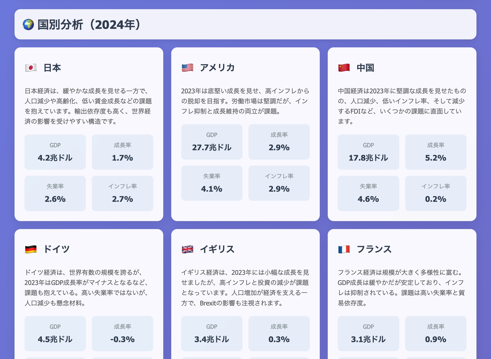

# World Bank Economic Dashboard

GitHub Actionsを活用したWorld Bank経済指標ダッシュボード。Gemini AIによる分析機能付き。



## 概要

このプロジェクトは、World Bank APIから主要各国の経済指標データを自動取得し、Gemini AIで分析した結果をインタラクティブなダッシュボードとしてGitHub Pagesに自動デプロイします。

## 主要機能

- **自動データ取得**: World Bank APIから経済指標データを定期取得
- **AI分析**: Gemini APIによる経済データの分析とインサイト生成
- **インタラクティブダッシュボード**: Chart.jsを使用した可視化
- **自動デプロイ**: GitHub Actionsによる自動更新とGitHub Pagesデプロイ
- **レスポンシブデザイン**: デスクトップ・モバイル対応

## 対象データ

### 対象国
- 日本 (JPN)
- アメリカ (USA)
- 中国 (CHN)
- ドイツ (DEU)
- イギリス (GBR)
- フランス (FRA)

### 経済指標
- GDP（現在価格、米ドル）
- GDP成長率（年率）
- 失業率
- インフレ率
- 一人当たりGDP
- 貿易（GDP比）

## プロジェクト構造

```
world-bank-dashboard/
├── .github/
│   └── workflows/
│       └── update-dashboard.yml    # GitHub Actionsワークフロー
├── src/
│   ├── data-collector.js           # World Bank APIデータ取得
│   ├── gemini-analyzer.js          # Gemini AI分析
│   ├── dashboard-generator.js      # HTMLダッシュボード生成
│   └── index.js                    # メインスクリプト
├── public/
│   ├── index.html                  # ダッシュボードHTML
│   ├── style.css                   # スタイルシート
│   └── script.js                   # フロントエンドJS
├── data/
│   └── (生成されたデータファイル)
├── package.json
└── README.md
```

## セットアップ

### 1. 依存関係のインストール

```bash
npm install
```

### 2. 環境変数の設定

`.env`ファイルを作成し、以下を設定：

```env
GEMINI_API_KEY=your_gemini_api_key_here
```

### 3. ローカル実行

```bash
# 全体のビルド実行
npm run build

# 個別実行
npm run collect-data      # データ取得
npm run analyze-data      # AI分析
npm run generate-dashboard # ダッシュボード生成
```

## GitHub Actionsの設定

### 必要なシークレット

GitHubリポジトリの Settings > Secrets and variables > Actions で以下を設定：

- `GEMINI_API_KEY`: Gemini APIキー

### 自動実行スケジュール

- **頻度**: 毎日午前9時（JST）
- **トリガー**: cronスケジュール + 手動実行可能

## 技術スタック

- **バックエンド**: Node.js
- **API**: World Bank API, Gemini API
- **フロントエンド**: HTML5, CSS3, JavaScript
- **可視化**: Chart.js
- **CI/CD**: GitHub Actions
- **ホスティング**: GitHub Pages

## ライセンス

MIT License

## 貢献

プルリクエストやイシューの報告を歓迎します。

## 参考リンク

- [World Bank API Documentation](https://datahelpdesk.worldbank.org/knowledgebase/articles/889392)
- [Gemini API Documentation](https://ai.google.dev/gemini-api/docs)
- [GitHub Actions Documentation](https://docs.github.com/en/actions)

